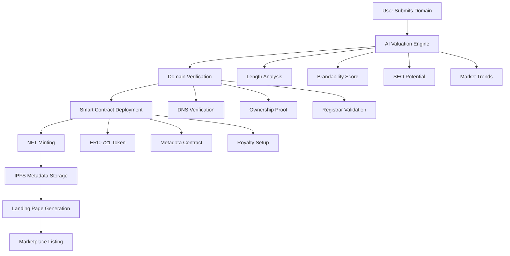
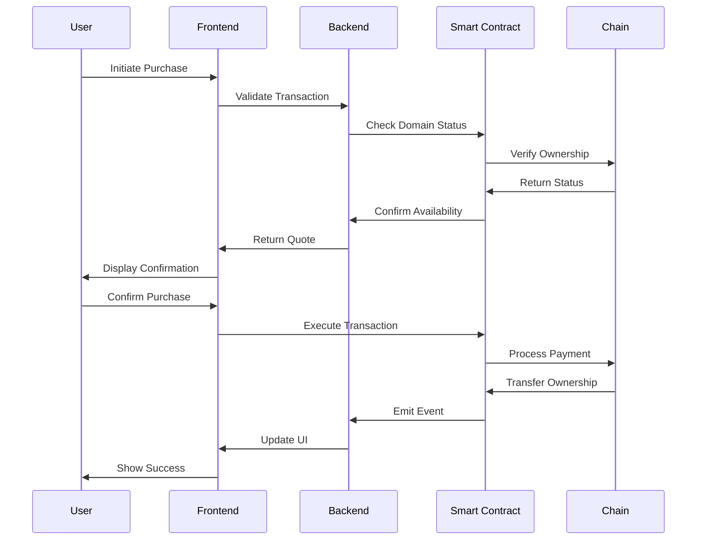
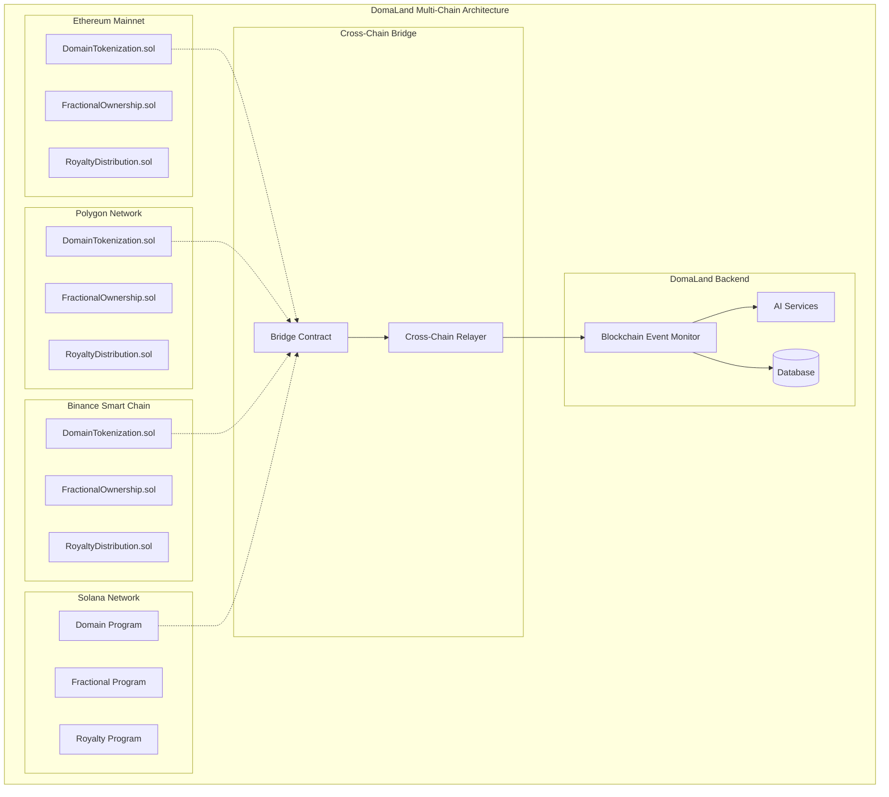
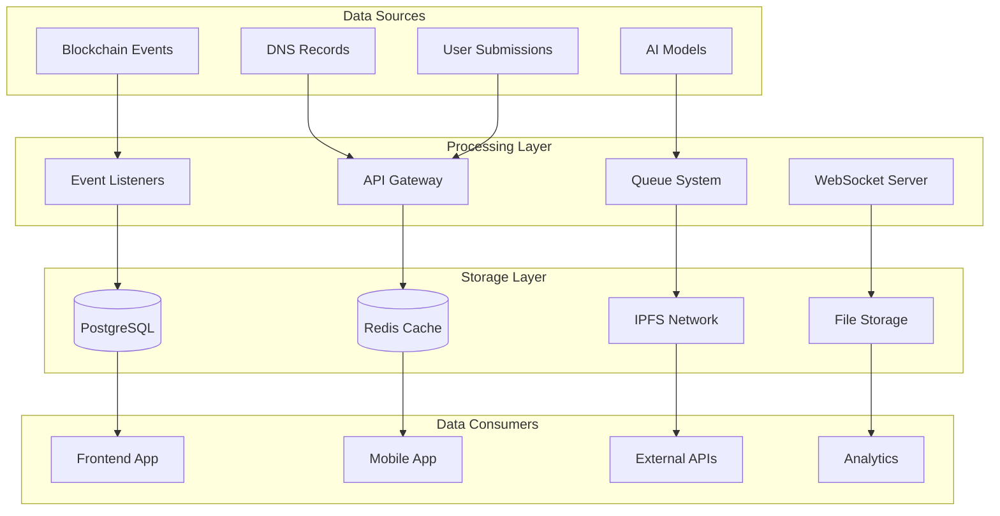

# **9. Platform Architecture**

## **9.1. System Overview**

DomaLand.AI is a comprehensive DomainFi platform built on a modern, scalable architecture that seamlessly integrates blockchain technology, artificial intelligence, and traditional web infrastructure. The platform is designed to transform domain names from static assets into dynamic, tradeable, and fractionalized digital assets.

### **9.1.1. Core Architecture Principles**

- **Modular Design**: Each component is independently deployable and scalable
- **Multi-Chain Support**: Native support for Ethereum, Polygon, BSC, and Solana
- **AI-First Approach**: Machine learning models power valuation, fraud detection, and content generation
- **Real-Time Synchronization**: Live blockchain state monitoring and DNS record synchronization
- **Security by Design**: Multi-layered security with audited smart contracts and fraud detection

### **9.1.2. System Components**

#### **Frontend Layer (React/TypeScript)**
- **User Interface**: Modern React-based SPA with TypeScript
- **State Management**: Context API with React Query for server state
- **Wallet Integration**: Multi-wallet support (MetaMask, WalletConnect, Phantom)
- **Real-Time Updates**: WebSocket connections for live data
- **Responsive Design**: Mobile-first approach with accessibility features

#### **Backend Layer (Python/Flask)**
- **API Gateway**: RESTful API with comprehensive domain management
- **Blockchain Integration**: Multi-chain Web3 connections and event monitoring
- **AI Services**: Machine learning models for valuation and fraud detection
- **Database Layer**: PostgreSQL with Redis for caching
- **Queue System**: Background job processing for scalability

#### **Smart Contract Layer (Solidity)**
- **Domain Tokenization**: ERC-721/ERC-1155 compliant domain NFTs
- **Fractional Ownership**: ERC-20 token-based domain shares
- **Marketplace**: Automated market maker with liquidity pools
- **Governance**: DAO-based decision making for fractionalized domains
- **Royalty Distribution**: Automated revenue sharing mechanisms

#### **AI/ML Layer**
- **Valuation Engine**: Multi-factor domain pricing algorithms
- **Content Generation**: Automated landing page creation
- **Fraud Detection**: Real-time transaction monitoring
- **Market Analysis**: Predictive analytics and trend identification

### **9.1.3. Technology Stack**

| Layer | Technology | Purpose |
|-------|------------|---------|
| **Frontend** | React 18, TypeScript, Vite | User interface and interactions |
| **Styling** | Tailwind CSS, Radix UI | Modern, accessible design system |
| **State Management** | React Query, Context API | Client-side state and caching |
| **Backend** | Python 3.11, Flask | API server and business logic |
| **Database** | PostgreSQL, Redis | Data persistence and caching |
| **Blockchain** | Web3.py, Ethers.js | Multi-chain integration |
| **Smart Contracts** | Solidity 0.8.19 | On-chain domain logic |
| **AI/ML** | OpenAI API, TensorFlow | Intelligent features |
| **Infrastructure** | Docker, AWS/GCP | Containerized deployment |

### **9.1.4. Scalability Architecture**

- **Horizontal Scaling**: Microservices architecture with load balancing
- **Database Sharding**: Partitioned data storage for high throughput
- **CDN Integration**: Global content delivery for optimal performance
- **Caching Strategy**: Multi-level caching (Redis, CDN, browser)
- **Queue Processing**: Asynchronous job processing for heavy operations

---

## **9.2. Workflow: From Domain Tokenization to Trading**

### **9.2.1. Domain Tokenization Process**



### **9.2.2. Trading Workflow**



### **9.2.3. Fractionalization Process**

1. **Proposal Creation**: Domain owner creates fractionalization proposal
2. **Community Voting**: Token holders vote on proposal parameters
3. **Smart Contract Deployment**: Fractional ownership contract deployed
4. **Share Distribution**: ERC-20 tokens minted and distributed
5. **Liquidity Pool Creation**: AMM pool established for trading
6. **Governance Setup**: DAO governance mechanisms activated

### **9.2.4. Cross-Chain Operations**

1. **Bridge Request**: User initiates cross-chain transfer
2. **Lock Assets**: Source chain assets locked in bridge contract
3. **Proof Generation**: Cryptographic proof of lock created
4. **Relay Verification**: Cross-chain relay validates proof
5. **Asset Minting**: Equivalent assets minted on destination chain
6. **Completion**: User receives assets on target chain

---

## **9.3. Multi-Chain Integration Diagram**

### **9.3.1. Supported Blockchain Networks**



### **9.3.2. Chain-Specific Configurations**

| Chain | Chain ID | RPC URL | Gas Token | Contract Addresses |
|-------|----------|---------|-----------|-------------------|
| **Ethereum** | 1 | `https://mainnet.infura.io/v3/...` | ETH | `0x742d35Cc...` |
| **Polygon** | 137 | `https://polygon-rpc.com` | MATIC | `0x5A0b54D5...` |
| **BSC** | 56 | `https://bsc-dataseed.binance.org` | BNB | `0x6fC21092...` |
| **Solana** | - | `https://api.mainnet-beta.solana.com` | SOL | `Program ID: ...` |

### **9.3.3. Cross-Chain Communication Protocol**

1. **Message Format**: Standardized cross-chain message structure
2. **Relay Network**: Decentralized relayers for message passing
3. **Proof Verification**: Cryptographic proofs for transaction validity
4. **Finality Confirmation**: Multi-block confirmation for security
5. **Fee Distribution**: Automatic fee calculation and distribution

### **9.3.4. Bridge Security Model**

- **Multi-Signature Wallets**: Required for bridge operations
- **Time Locks**: Delayed execution for large transfers
- **Slashing Conditions**: Penalties for malicious behavior
- **Insurance Fund**: Coverage for bridge-related losses
- **Audit Requirements**: Regular security audits of bridge contracts

---

## **9.4. Data Flow and Storage**

### **9.4.1. Data Architecture Overview**



### **9.4.2. Database Schema Design**

#### **Core Tables**

```sql
-- Users table
CREATE TABLE users (
    id SERIAL PRIMARY KEY,
    wallet_address VARCHAR(42) UNIQUE NOT NULL,
    email VARCHAR(255),
    created_at TIMESTAMP DEFAULT NOW(),
    updated_at TIMESTAMP DEFAULT NOW()
);

-- Domains table
CREATE TABLE domains (
    id SERIAL PRIMARY KEY,
    name VARCHAR(255) UNIQUE NOT NULL,
    token_id VARCHAR(50),
    owner_id INTEGER REFERENCES users(id),
    estimated_value DECIMAL(18,2),
    ipfs_hash VARCHAR(255),
    is_verified BOOLEAN DEFAULT FALSE,
    is_listed BOOLEAN DEFAULT FALSE,
    listing_price DECIMAL(18,2),
    created_at TIMESTAMP DEFAULT NOW()
);

-- Transactions table
CREATE TABLE transactions (
    id SERIAL PRIMARY KEY,
    domain_id INTEGER REFERENCES domains(id),
    from_user_id INTEGER REFERENCES users(id),
    to_user_id INTEGER REFERENCES users(id),
    transaction_hash VARCHAR(66),
    amount DECIMAL(18,2),
    transaction_type VARCHAR(50),
    status VARCHAR(20),
    created_at TIMESTAMP DEFAULT NOW()
);

-- Fractional ownership table
CREATE TABLE fractional_ownerships (
    id SERIAL PRIMARY KEY,
    domain_id INTEGER REFERENCES domains(id),
    total_shares INTEGER NOT NULL,
    share_price DECIMAL(18,2),
    contract_address VARCHAR(42),
    created_at TIMESTAMP DEFAULT NOW()
);
```

### **9.4.3. Data Synchronization Strategy**

#### **Real-Time Synchronization**
- **Blockchain Events**: WebSocket connections to monitor contract events
- **DNS Updates**: Periodic DNS record verification and updates
- **Price Feeds**: Real-time price updates from multiple sources
- **User Actions**: Immediate UI updates with optimistic rendering

#### **Batch Processing**
- **AI Valuations**: Scheduled batch processing for domain valuations
- **Analytics**: Daily aggregation of trading metrics
- **Report Generation**: Weekly/monthly performance reports
- **Data Cleanup**: Automated cleanup of expired data

### **9.4.4. Caching Strategy**

#### **Multi-Level Caching**
1. **Browser Cache**: Static assets and API responses
2. **CDN Cache**: Global content delivery
3. **Redis Cache**: Application-level caching
4. **Database Cache**: Query result caching

#### **Cache Invalidation**
- **Time-based**: Automatic expiration after TTL
- **Event-based**: Invalidation on data changes
- **Manual**: Admin-triggered cache clearing
- **Version-based**: Cache versioning for updates

### **9.4.5. Data Security and Privacy**

#### **Encryption**
- **At Rest**: AES-256 encryption for sensitive data
- **In Transit**: TLS 1.3 for all communications
- **Database**: Encrypted database connections
- **Backups**: Encrypted backup storage

#### **Access Control**
- **Role-based**: Granular permission system
- **API Keys**: Secure API authentication
- **Rate Limiting**: Protection against abuse
- **Audit Logging**: Comprehensive access logging

---

## **9.5. Security Measures**

### **9.5.1. Audited Smart Contracts**

#### **Contract Audit Process**
1. **Code Review**: Comprehensive static analysis
2. **Formal Verification**: Mathematical proof of correctness
3. **Penetration Testing**: Simulated attack scenarios
4. **Third-Party Audit**: Independent security assessment
5. **Continuous Monitoring**: Ongoing security monitoring

#### **Audited Contracts**
- **DomainTokenization.sol**: ERC-721 domain tokenization
- **FractionalOwnership.sol**: ERC-20 fractional shares
- **RoyaltyDistribution.sol**: Automated revenue sharing
- **BridgeContract.sol**: Cross-chain asset transfers

#### **Security Features**
- **Reentrancy Protection**: Guard against reentrancy attacks
- **Access Control**: Role-based function access
- **Pausable Operations**: Emergency stop functionality
- **Upgradeable Contracts**: Secure upgrade mechanisms

### **9.5.2. Multi-Signature Wallets**

#### **Implementation**
- **Threshold Signatures**: M-of-N signature requirements
- **Hardware Security**: Hardware wallet integration
- **Time Locks**: Delayed execution for critical operations
- **Emergency Procedures**: Rapid response protocols

#### **Use Cases**
- **Treasury Management**: Platform fund management
- **Bridge Operations**: Cross-chain transfer authorization
- **Governance**: DAO decision execution
- **Emergency Actions**: Critical system interventions

### **9.5.3. AI-Powered Fraud Detection**

#### **Machine Learning Models**

```python
class FraudDetectionEngine:
    def __init__(self):
        self.models = {
            'transaction_anomaly': TransactionAnomalyDetector(),
            'domain_verification': DomainVerificationModel(),
            'price_manipulation': PriceManipulationDetector(),
            'wash_trading': WashTradingDetector()
        }
    
    def analyze_transaction(self, transaction_data):
        risk_scores = {}
        for model_name, model in self.models.items():
            risk_scores[model_name] = model.predict(transaction_data)
        
        overall_risk = self.calculate_overall_risk(risk_scores)
        return {
            'risk_level': overall_risk,
            'detailed_scores': risk_scores,
            'recommendations': self.generate_recommendations(risk_scores)
        }
```

#### **Detection Capabilities**
- **Transaction Anomalies**: Unusual transaction patterns
- **Domain Verification**: Fake or compromised domains
- **Price Manipulation**: Artificial price inflation
- **Wash Trading**: Circular trading patterns
- **Sybil Attacks**: Multiple fake accounts
- **Flash Loan Attacks**: DeFi protocol exploits

#### **Real-Time Monitoring**
- **Transaction Screening**: Pre-transaction risk assessment
- **Behavioral Analysis**: User behavior pattern analysis
- **Network Monitoring**: Blockchain network health monitoring
- **Alert System**: Immediate notification of suspicious activity

### **9.5.4. Additional Security Measures**

#### **Infrastructure Security**
- **DDoS Protection**: Cloudflare integration
- **SSL/TLS**: End-to-end encryption
- **Firewall**: Network-level protection
- **Intrusion Detection**: Real-time threat monitoring

#### **Application Security**
- **Input Validation**: Comprehensive input sanitization
- **SQL Injection Prevention**: Parameterized queries
- **XSS Protection**: Content Security Policy
- **CSRF Protection**: Token-based validation

#### **Operational Security**
- **Security Training**: Regular team security education
- **Incident Response**: Documented response procedures
- **Backup Strategy**: Regular encrypted backups
- **Disaster Recovery**: Business continuity planning

#### **Compliance and Governance**
- **Regulatory Compliance**: GDPR, CCPA compliance
- **Audit Trails**: Comprehensive logging
- **Data Retention**: Automated data lifecycle management
- **Privacy by Design**: Privacy-first architecture

### **9.5.5. Security Monitoring and Response**

#### **Monitoring Systems**
- **Real-Time Alerts**: Immediate threat notifications
- **Security Dashboards**: Centralized security monitoring
- **Log Analysis**: Automated log analysis and correlation
- **Performance Metrics**: Security performance tracking

#### **Incident Response**
1. **Detection**: Automated threat detection
2. **Analysis**: Rapid threat assessment
3. **Containment**: Immediate threat isolation
4. **Eradication**: Threat removal and cleanup
5. **Recovery**: System restoration
6. **Lessons Learned**: Post-incident analysis

#### **Continuous Improvement**
- **Security Updates**: Regular security patches
- **Vulnerability Scanning**: Automated vulnerability assessment
- **Penetration Testing**: Regular security testing
- **Security Reviews**: Periodic security architecture reviews

---

## **Conclusion**

The DomaLand.AI platform architecture represents a comprehensive, secure, and scalable solution for domain tokenization and trading. By combining cutting-edge blockchain technology, artificial intelligence, and traditional web infrastructure, the platform provides a robust foundation for the future of DomainFi.

The multi-layered security approach, combined with real-time monitoring and AI-powered fraud detection, ensures that users can trade domain assets with confidence. The modular architecture allows for easy scaling and feature additions, while the multi-chain support provides flexibility and liquidity across different blockchain networks.

This architecture not only meets current requirements but is designed to evolve with the rapidly changing landscape of Web3 and domain trading, positioning DomaLand.AI as a leader in the DomainFi space.
